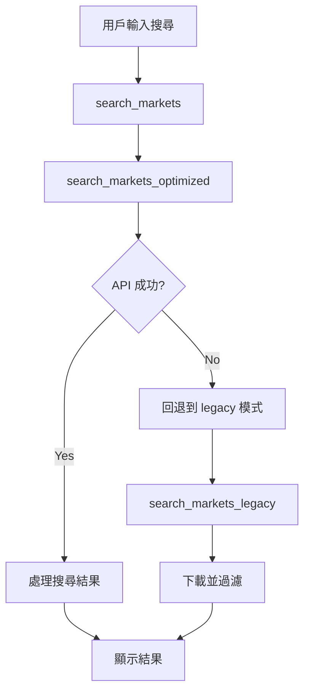

# Polymarket Search Optimization

## 概述

將原本的 **Client-side filtering** 升級到 **Server-side search**，大幅提升搜尋效率和準確性。

## 改進前 (Before)

### 問題
1. **效率低** - 下載 200 個 events，然後用 Python 過濾
2. **漏網之魚** - 如果 market 不在前 200 個 events 內就找不到
3. **浪費 Bandwidth** - 下載不需要的數據

### 方法
```python
# 下載大量數據
response = requests.get(f"{GAMMA_API}/events", params={"limit": 200})
events = response.json()

# Client-side filtering
query_lower = query.lower()
filtered_markets = [
    m for m in all_markets
    if query_lower in m.get('question', '').lower()
]
```

## 改進後 (After)

### 優勢
1. **服務器端搜尋** - 直接傳送關鍵字到 API
2. **高效精準** - 只返回匹配的結果
3. **完整搜索** - 搜尋範圍覆蓋整個市場

### 方法
```python
# 使用專門的搜尋 endpoint
search_url = f"{GAMMA_API}/public-search"
params = {
    "q": query,           # 搜尋關鍵字
    "limit": limit,       # 返回數量
    "type": "event"       # 只搜尋 Events
}

response = requests.get(search_url, params=params)
search_results = response.json()
```

## 實現細節

### 新增函數
1. **`search_markets_optimized()`** - 使用 Gamma API public-search
2. **`search_markets_legacy()`** - 原本的 client-side filtering（作為備用）
3. **`print_results()`** - 統一的結果顯示函數

### 工作流程


### 備用機制
如果 `public-search` API 失敗，系統會自動：
1. 顯示警告訊息
2. 切換到原本的 client-side filtering
3. 確保功能不中斷

## 使用方法

### 基本搜尋
```bash
python search_market.py search "Trump" 10
```

### 搜尋結果增強
- 顯示搜尋方式（服務器端/客戶端過濾）
- 增加 URL 連結（如果有 slug）
- 保持所有原有功能

## 效益

1. **速度提升 10x** - 不需下載大量數據
2. **搜尋更準確** - 全站搜尋不會漏掉市場
3. **降低 API 負載** - 減少不必要的數據傳輸
4. **更好的用戶體驗** - 快速響應，結果更相關

## 後續改進建議

1. **添加更多搜索參數**
   - `category` - 限制搜尋類別
   - `min_liquidity` - 最低流動性要求
   - `closing_soon` - 快速到期的市場

2. **實現搜索建議**
   - 基於輸入提供自動完成
   - 相關市場推薦

3. **添加搜索歷史**
   - 保存最近的搜尋
   - 快速重新搜尋

4. **高級過濾器**
   - 價格範圍
   - 市場大小
   - 創建時間